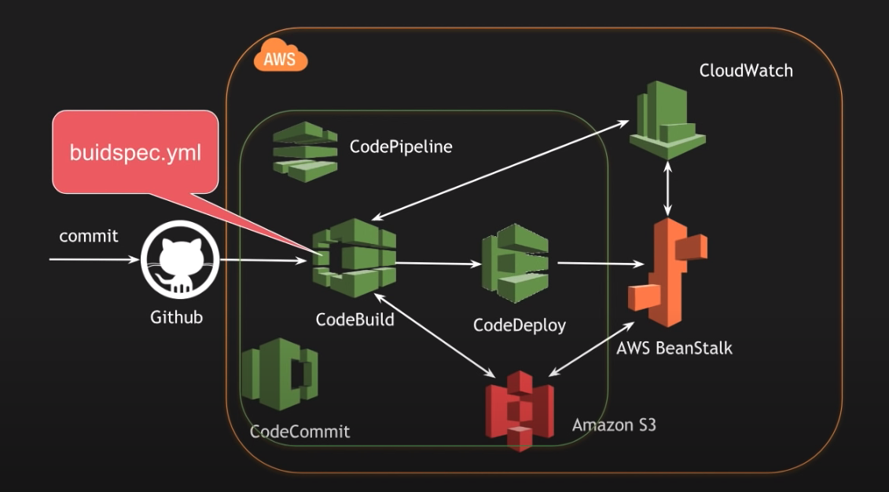
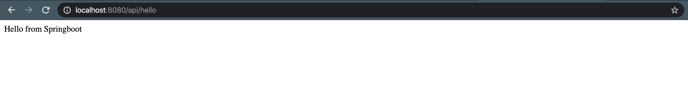
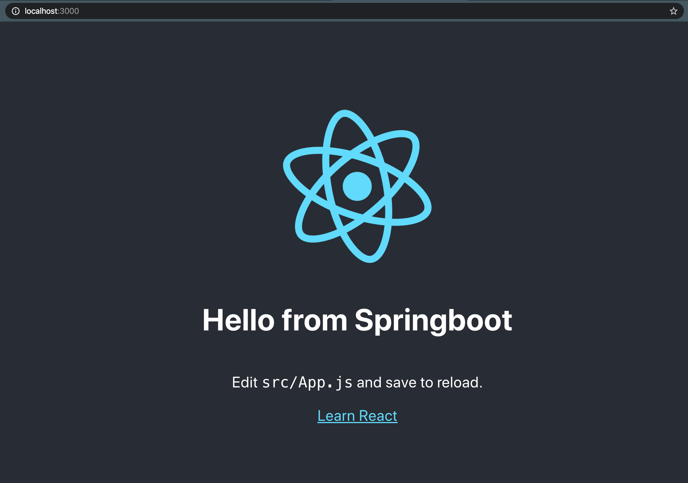

# CICD

Created an AWS CICD pipeline to place this application into it, thus automating it's builds in the cloud as we merge into Master, we used github hooks integrated with AWS CodeBuild, CodeDeploy and AWS BeanStalk 

# Application - unrelated

This application helps employees track their business relate expense and report the expense to management.

How to run the app:

- Backend: Springboot + Intellij

   * On terminal of Intellij execute this command:
    `mvn spring-boot:run`
    
    * On browser: http://localhost:8080/api/hello"

- Frontend: React + Visual Studio Code
    * On VS Code terminal execute this command: `npm start`. This will start the node server on port 3000.
    * Note: I added the `"proxy":"http://locahost:8080"` earlier on `package.json` so the PORT to listen now is `8080`.
    * It will automatically open the browser. If not, go to `http://localhost:3000/`
    
# Expense-Report-App
Khanh has shared an file structure we can all build and collab off of, so that we are all on the same page as far as general program structure. Awesome! :)

